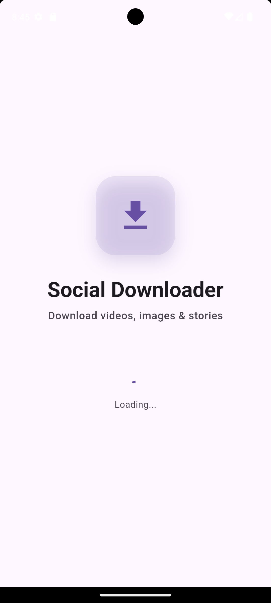
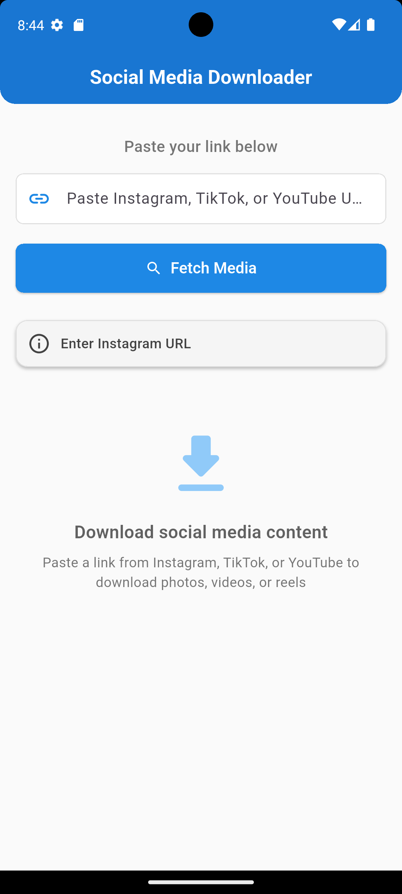
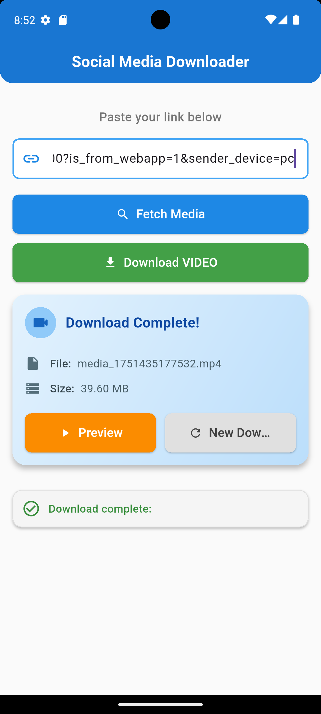

---

# 📥 Social Media Downloader

A simple and efficient Flutter application to download Instagram Reels and media content directly to your device. Paste an Instagram post or reel URL, fetch the media, and download it with ease!

---

## 🚀 Features

- **Instagram Media Download**: Download videos from Instagram Reels and posts.
- **URL Validation**: Ensures only valid Instagram URLs are processed.
- **Video Preview**: Watch the video before downloading.
- **File Management**: Saves files to device storage with proper permissions.
- **Cross-Platform**: Works on Android and iOS.
- **Clean Architecture**: Separation of UI, business logic, and data models.
- **Reusable Widgets**: Custom buttons, image, and video previews.

---

## 🖼️ Screenshots

| Splash Screen | Search Screen | Video Preview | Success State |
|---------------|----------------|----------------|----------------|
|  |  |  |  |

---

## 📦 Dependencies

- `dio` - HTTP client for downloads
- `http` - API requests
- `path_provider` - File system access
- `permission_handler` - Permission management
- `video_player` - Video preview
- `chewie` - Enhanced video player UI
- `open_file` - Open downloaded files
- `cupertino_icons` - iOS style icons

---

## 🛠️ Installation

1. **Clone the repository:**
   ```bash
   git clone https://github.com/yourusername/insta_reels.git
   cd insta_reels
   ```

2. **Install dependencies:**
   ```bash
   flutter pub get
   ```

3. **Run the app:**
   ```bash
   flutter run
   ```

---

## ⚙️ Configuration

- **API Key**: The app uses RapidAPI for Instagram media extraction. Update the API key and host in `lib/utils/constants.dart` if needed.
- **File Storage**:
  - **Android**: Files are saved to `/storage/emulated/0/Download/`
  - **iOS**: Files are saved to the app's documents directory
- **Permissions**: The app requests storage permissions to save files. Grant permissions when prompted.

---

## 📂 Project Structure

```
lib/
├── main.dart                 # App entry point
├── screens/                  # UI screens (Splash, Download)
├── services/                 # Business logic (Instagram, Download, Permissions)
├── models/                   # Data models (Media info)
├── widgets/                  # Reusable UI components (Button, Previews)
└── utils/                    # Constants and configuration
```

---

## 🧪 Running Tests

```bash
flutter test
```
*Note: The default widget test is included. Add more tests for better coverage!*

---

## 🤝 Contributing

1. Fork the repository
2. Create a feature branch (`git checkout -b feature/your-feature`)
3. Commit your changes (`git commit -m 'Add your feature'`)
4. Push to the branch (`git push origin feature/your-feature`)
5. Open a Pull Request

---

**Built with ❤️ using Flutter**

---

Would you like this README saved as `README.md` in your project root, or do you want to update/replace the one in `lib/README.md`?
